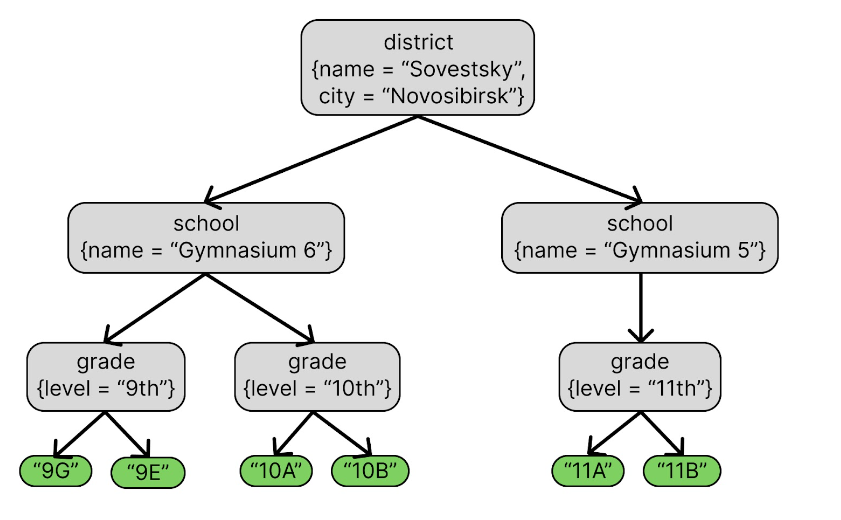

# s_expr_data

Проект "Представление данных в S-выражениях". Сделан в рамках курса "Проектирование ПО". 

## Общее описание

Библиотека для работы с данными с древовидной структуре. Семантически похоже на xml, но проще.

Данные представляются s-выражениями вида
```
s_expression = (name {attributes}? s_expr_1 s_expr_2 ... s_expr_n)
```
, где `n >= 0`.

Для данных можно написать схему(обобщенное представление данных), с которой можно будет сверять данные на соответствие этому обобщенному виду.

Также разработан язык навигации и простых запросов на данных. Язык основан на XPath для XML.

## Формат представления данных

Данные представляют собой дерево, в котором есть для вида вершины: `ElementNode`, `ValueNode`. 

`ValueNode` - это вершина, содержащая в себе какое-то значение. Эта вершина всегда является листом в дереве. Поддерживается три вида данных, которые можно сохранить:
1. целое число не большее `int64`,
2. строка,
3. число с плавающей запятой.

`ElementNode` - это вершина, которая содержит в себе другие вершины. У этой вершины есть свое имя `name` (семантически то же, что и название тега в xml).
Также у этой вершины есть аттрибуты. Аттрибут - это пара значений имя и строка, где имя - это имя аттрибута, а строка - это значение этого аттрибута.
В отличие от `ValueNode` `ElementNode` может быть любой вершиной дерева.

### Грамматика

`ValueNode` - это просто записанное значение (целое число, число с плавающей запятой или строка).
Числа записываются как обычно. А строки записываются, как строки из `json`, то есть строка начинается
и заканчивается символом `"` и в строке символы не из Ascii таблицы экранируются. Подробно почитать можно [здесь](https://www.json.org/json-en.html).

`ElementNode` - это записанное в круглых скобках имя вершины, аттрибуты и вершины дети, разделенные пробелом.
Аттрибуты записываются в фигурных скобках, каждая пара имя-значение отделяется от другой запятой. 
Между собой имя значение отделяются пробелом.

Имя аттрибута или вершины - это последовательность букв латинского алфавита, цифр или `_`, которая начинается с буквы.
Везде дальше данное множество имен будет обозначено QName.

Более подробно можно посмотреть в файле [Data.g4](src/main/antlr/Data.g4), в котором описана грамматика
данных для генератора Antlr. 

### Пример данных



Представление данных:
```
(district {name "Sovetsky", city "Novosibirsk"}
    (school {name "Gymnasium 6"}
        (grade {level "9th"} "9G" "9E")
        (grade {level "10th"} "10A" "10B")
    )
    (school {name "Gymnasium 5"}
        (grade {level "11th"} "11A" "11B")
    )
)
```

## Схема данных

Множество схем является подмножеством данных,
то есть схемы любую схему можно прочитать как данные.

В отличие от данных схема состоит только из `ElementNode`.
А также у каждой `ElementNode` имя должно быть:
1. `schema` - имя корневого элемента схемы 
2. `type` - описывает предопределенную структуру элемента, аналог `xsd:complexType`
3. `element` - описывает структуру для `ElementNode`
4. `value` - описывает структуру для `ValueNode`
5. `attribute` - описывает структуру для аттрибута

Для схемы корневой элемент должен иметь имя `schema`, а также у этого элемента нет аттрибутов.
Корневой элемент может содержать элементы с именем `type`, `element`, `value`.
У корневого элемента должен быть в точности один элемент с именем `element` или `value`.
В этом элементе и будет описана схема. Оставшиеся элемента с именем `type` описывают предопределенные структуры элементов.

Предопределенная структура может быть применена только для элемента с именем `element`.
В элементе с именем `type` можно ссылаться только ранее определенные элементы `type` (на себя можно ссылаться).

Подробное описание для каждого элемента схемы:
1. [schema](#schema)
2. [type](#type)
3. [element](#element)
4. [value](#value)
5. [attribute](#attribute)

### schema
Элемент с таким именем должен быть **только** корневым в схеме.
У него нет никаких аттрибутов. Содержит в себе элементы `type`, `element`, `value`.

### element

Элемент, который описывает `ElementNode` данных.

Содержит в себе `element`, `value`, `attrbute`.

| Имя аттрибута       | Обязательность | Множество значений                                 | Для чего нужен                                   |
|---------------------|----------------|----------------------------------------------------|--------------------------------------------------|
| name                | дополнительный | Qname                                              | определяет имя `ElementNode`                     |
| minOccurs/maxOccurs | дополнительный | число от 0 до IntMax или "unbounded" для maxOccurs | определяет возможное количество данных элементов | 
| type                | дополнительный | Qname                                              | ссылка на раннее определенную структуру вершины  |

minOccurs и maxOccurs должны быть определены вместе или не определены вообще. В случае если они не определены, то количество считается равным 1.

Если определен type, то любую информацию которая уже определена в типе можно переопределить. 
Также если такая вершина содержит другие вершины, то добавленные вершины будут идти после вершин определенных в типе.

### type

Элемент, который предопределяет структуру элемента. Аналог `xsd:complexType`.

Также, как и `element` содержит в себе `element`, `value`, `attribute`.

| Имя аттрибута | Обязательность | Множество значений | Для чего нужен                                                     |
|---------------|----------------|--------------------|--------------------------------------------------------------------|
| type_name     | обязателен     | Qname              | определяет имя по которому в `element` будут ссылаться на этот тип |
| element_name  | дополнительный | Qname              | определяет имя корневого `element` для данного типа                | 


### value

Элемент, который описывает `ValueNode` данных.

Не содержит в себе внутренних элементов.

| Имя аттрибута       | Обязательность | Множество значений                                 | Для чего нужен                                   |
|---------------------|----------------|----------------------------------------------------|--------------------------------------------------|
| type                | дополнительный | "string" \| "int" \| "double"                      | определяет тип `ValueNode`                       |
| minOccurs/maxOccurs | дополнительный | число от 0 до IntMax или "unbounded" для maxOccurs | определяет возможное количество данных элементов | 

minOccurs и maxOccurs должны быть определены вместе или не определены вообще. В случае если они не определены, то количество считается равным 1.


### attribute

Элемент, который описывает аттрибут `ElementNode` данных.

Не содержит в себе внутренних элементов.

| Имя аттрибута | Обязательность | Множество значений                       | Для чего нужен                            |
|---------------|----------------|------------------------------------------|-------------------------------------------|
| name          | обязателен     | Qname                                    | определяет имя аттрибута                  |
| use           | дополнительный | "required" \| "optional" \| "prohibited" | определяет должен ли быть данный аттрибут | 


### Пример схемы

Пример схемы для данных из [примера](#пример-данных)
```
(schema
    (type {type_name "grade_type", element_name "grade"}
        (attribute {name "level", use "required"})
        (value {type "string", minOccurs "1", maxOccurs "unbounded"})
    )
    (element {name "district"}
        (attribute {name "name", use "required"})
        (attribute {name "city", use "optional"})
        (element {name "school", minOccurs "0", maxOccurs "unbounded"}
            (attribute {name "name", use "required"})
            (element {type "grade_type", minOccurs "0", maxOccurs "12"})
        )
    )
)
```

## Язык запросов и навигации

Язык запросов основан на Xpath.

У запроса есть контекст, который содержит множество кастомных предикатов для сравнения строк и одну из вершин данных, 
через которую запрос и будет считаться запрос.

Грамматика для запросов описана в файле [Path.g4](src/main/antlr/Path.g4). 

Запрос может начинаться с `//` или `/`. Если запрос начинается с `//`, то поиск идет со всех внутренних вершин всего дерева данных.
Если с `/`, то только из корня дерева данных. В случае если запрос начинается не с одной из этих комбинаций, то поиск начинается с вершины из контекста.

Дальше запрос строится из чередующихся `Step` и `Transition`.
`Step` описывает куда хотим пойти и возможные ограничения на аттрибуты, того куда хотим пойти.
`Transition` описывает нужно ли сделать переход с переменной вложенностью (рассмотреть всех потомков, как возможных кандидатов) или остаться в данной вершине.
Перед каждым `Step` кроме первого должен идти `Transition`. И после каждого `Transition` должен идти `Step`. 
То есть запрос состоит из чередующихся `Step` и `Transition`, причем начинается и заканчивается `Step`.

`Transition` = `/` или `//`. `//` означают переход с переменной вложенностью, `/` остаться в данной вершине.

`Step` состоит из двух частей `Axis` и `Requirement`. 

`Axis` описывает, то куда переходим. Возможные виды:
1. `.` остаемся в текущей вершине
2. `..` переходим в родительскую вершину
3. `*` переходим в любого ребенка
4. `@value` переходим в `ValueNode`
5. `@element` переходим в `ElementNode`
6. написано Qname - это значит переходим в `ElementNode` с таким именем.

`Requirement` - это описание какого-то ограничения для аттрибутов вершины в которую переходим. Пишется в квадратных скобках.
Есть два типа:
1. Сравнение на равенство или неравенство двух значений. Примеры: `[@attr1 = @attr2]` или `[@attr1 != "some_json_string"]`.
2. Вызов предиката определенного в контексте с этими значениями. Примеры: `[some_predicate("azaza", @attr)]` или `[predicate(@*, @attr)]`.

Для подстановки значения аттрибута в запросе пишется `@name`, где `name` - это имя нужного аттрибута.
Также поддерживается перебор всех возможных значений аттрибутов, для этого можно написать `@*`.

У `ValueNode` есть мнимый аттрибут `type` описывающий значение какого типа в этой вершине, к которому также можно обращаться в `Requirement`.
Возможные значения `type`: `"string"`, `"int"`,`"double"`.

### Примеры запросов
```
//el/*[@id=@id2]
@element/../*//name[func("asda", "sada")]
//@value[type="int"]
/div/a/@value[type="string"]
```
